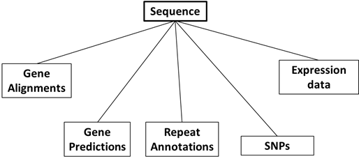
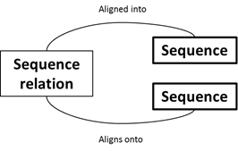
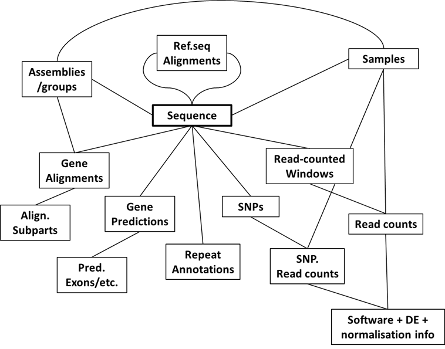
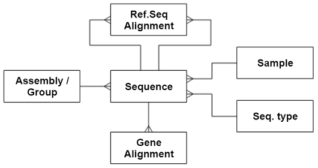

The following exercises are based on some real project data and are designed
to give more practice with SQL statements, especially SELECT queries,
following on from the 
[SQL Introduction tutorial](https://csiro-data-school.github.io/sql-intro/).
  
Input data may be downloaded [here]({{ page.root }}/files/sqlExerciseData.zip)

## A DNA/RNA sequence alignments and annotations database

For a research project looking at the plant species Hieracium, a large quantity of sequences 
of various types (DNA, RNA, predicted proteins) had been accumulated, from a large number of 
varieties/samples. Further information had been built up in relation to these sequences, e.g. 
gene predictions, alignments to annotation databases, SNPs, expression data, etc..  

A system for storing and querying this data resource was developed, which made use of an SQL backend.
An initial simple representation of the data being stored, where each box is a separate table, might be:

  
However, an additional important detail we wanted to capture was the relations between our 
sequence records themselves. E.g. an RNA sequence may be fully contained within a longer 
DNA sequence, which is itself a sequence record in the database. Or an annotated protein 
sequence may have originated from a DNA sequence. Essesntially, the Sequences table has a
many-to-many releationship to itself.  
To capture such hierarchical relationships between sequence records, another table is needed 
that defines these connections.
  

  
The final database design for this project ended up looking something like this:
  

  
However, for this example exercise, we’re just going to play with a subset of data from a 
simplified subset of the database, which just looks like this:  
  

  
The tables and their columns are as follows:
  
|Sequence|
|---:|:---|
|id|integer, primary key|
|name|string|
|length|integer|
|belongsGroup|integer, FK seqgroup.id|
|isSample|integer, FK sample.id|
|isType|integer, FK seqtype.id|

|Sample|
|---:|:---|
|id|integer, primary key|
|name|string|
|species|string|
|description|string|

|SeqGroup|
|---:|:---|
|id|integer, primary key|
|name|string|
|description|string|

|SeqType|
|---:|:---|
|id|integer, primary key|
|type|string|

|SeqRelation|
|---:|:---|
|id|integer, primary key|
|parentSeq|integer, FK sequence.id|
|childSeq|integer, FK sequence.id|
|strand|boolean|
|pStart|integer|
|pEnd|integer|
|cStart|integer|
|cEnd|integer|
|method|string|

|AlignedAnnot|
|---:|:---|
|id|integer, primary key|
|onSequence|integer, FK sequence.id|
|start|integer|
|end|integer|
|strand|boolean|
|name|string|
|annotation|string|
|species|string|
|source|string|
|method|string|
|score|string|
 
**Notes**:
1. In real use, the ’sequence’ table would also contain a column for the actual 
DNA/RNA/protein sequences each sequence row represents (e.g. AGCATGCTAG…) but that is 
left out of this exercise to reduce file size.  As is, the ’sequence’ table just contains 
details *about* sequences.

2. FK = Foreign key, i.e. an ID referencing a row of a different table, creating association.

3. The ‘seqRelation’ has 2 foreign keys, both back to the sequence table, ‘childSeq’ and 
‘parentSeq’.  This pair defines a relationship between two sequences- that a ‘childSeq’ is a 
sub-sequence of a ‘parentSeq’ or that a ‘childSeq’ aligns onto a ‘parentSeq’. 
For example, a gene sequence that originates within a longer genome sequence, may be defined 
with a child/parent relationship.



