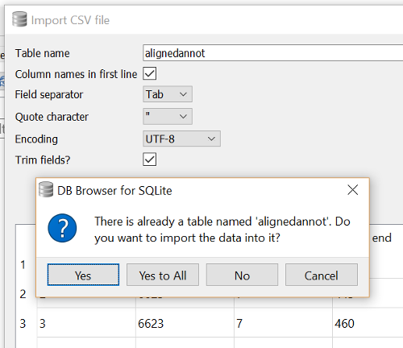

The following tab-separated text files are 
[included]({{ page.root }}/files/sqlExerciseData.zip), 
which contain data ready to be loaded into the database described on the previous page 
(they correspond to tables as per the start of their filenames):
```
samples1.txt
seqgroups1.txt
seqtypes.txt
sequences1-D18-genomic.txt
sequences2-D36-RNA.txt
sequences3-D18-augustusGenePredict.txt
seqrelations1-D18augPred-vs-D18g.txt
seqrelations2-D36rna-vs-D18g.txt
alignedannot1-D18augPred-vs-NCBI-nr.txt
```

Your task is to...

**1.** Create a new database. You may work with the Sqlite3 command line interface, or 
use the DB Browser GUI.

**2.** Write and run the CREATE TABLE statements required to create the tables described on 
the previous page.  Here are a couple of examples to get you started *:

~~~
CREATE TABLE sample (  
  id integer PRIMARY KEY,  
  name text,  
  species text,  
  description text  
);  
  
CREATE TABLE sequence (  
  id integer PRIMARY KEY,  
  name text,  
  length integer,  
  belongsGroup integer,  
  isSample integer,  
  isType integer,  
  FOREIGN KEY (belongsGroup) REFERENCES seqgroup(id),  
  FOREIGN KEY (isSample) REFERENCES sample(id),  
  FOREIGN KEY (isType) REFERENCES seqtype(id)  
);  
~~~
{: .sql}
  
Make sure you list columns in the same order as listed above, as this is also the 
same order as in the data text files. When importing the data in the next step, 
the column order must match!
 
\* Note, if making use of foreign key definitions (which is good practice), the order that you 
create the tables will matter. You can’t reference another table until you’ve first 
created that other table! E.g. you'll need to create certain other tables *before* 
creating the sequence table.


**3.** Load/Import data from the text files into their corresponding tables.   
Note, again, if making use of foreign keys, the order in which you load tables may matter.
You should import records that will be referenced in another table, *before* you import those 
records containing the references.
  
Our input files are tab-separated and each contain a header row.  
  
Using DB browser, data may be imported by clicking 'File' -> 'Import' -> 'Table from CSV'.  
Assure that you change the 'Table name' field to match the name of a table you created,
have 'Column names in first line' checked, and 'Field separator' set to 'Tab'.


  
If using SQLite3 command line tool we can import from the tab-text files into the tables 
using a couple of tricks:

```
.separator "\t"
.import "|tail -n +2 samples1.txt" sample
.import "|tail -n +2 seqgroups1.txt" seqgroup
.import "|tail -n +2 seqtypes.txt" seqtype
.import "|tail -n +2 sequences1-D18-genomic.txt" sequence
.import "|tail -n +2 sequences2-D36-RNA.txt" sequence
.import "|tail -n +2 sequences3-D18-augustusGenePredict.txt" sequence
.import "|tail -n +2 alignedannot1-D18augPred-vs-NCBI-nr.txt" alignedannot
.import "|tail -n +2 seqrelations1-D18augPred-vs-D18g.txt" seqrelation
.import "|tail -n +2 seqrelations2-D36rna-vs-D18g.txt" seqrelation
```

The ‘.separator’ command sets our import file field separator to be tabs.  
‘tail -n +2’ skips the first row of a file, i.e. our header row.
  
Once you have successfully created the tables and imported data from each of
the text files, you're ready to move onto the next part of the exercise.
  


